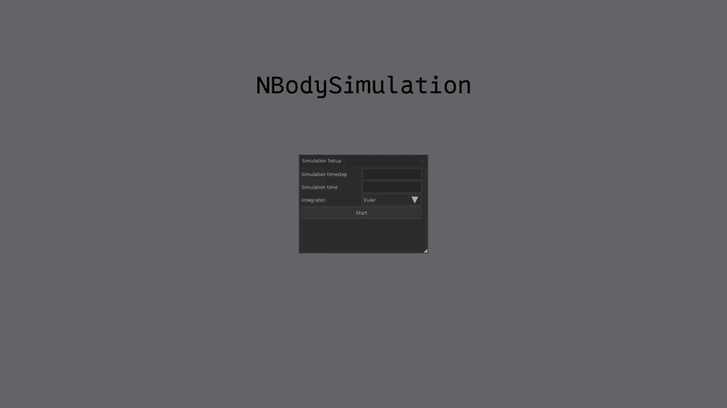

##  About
N-body simulator that currently support euler and verlet integration.

## Installation
1. Download and unzip NBodySimulation.zip in the release page
1. Run NBodySimulation.exe 👍

## Features
- **Multiple Integrators** – Supports Euler and Verlet for (somewhat) flexible simulation accuracy.
- **Custom Time Steps** – Adjustable simulation timestep to balance performance and precision.
- **Real-time Visualization** – Visualize body positions and trajectories in 3D as the simulation runs.
- **Configurable Simulation Time** – Run simulations for arbitrary durations.

## Controls
- **w,a,s,d**: move the camera
- **scroll up/down**: zoom in/out
- **space**: pause/resume the simulation
- **r**: toggle planet rendering
- **t**: toggle planet trail
- **f**: toggle planet names
- **l**: spawn 500 planets in a circular orbit around the sun
- **x**: center the camera on a planet
- **n**: switch the centered camera to the next planet in the system

## Credits / Libraries Used
This project relies on the following libraries/frameworks:
- LÖVE2D – https://love2d.org
- Nuklear Love Module – https://github.com/keharriso/love-nuklear
- Hump helper library - https://github.com/vrld/hump
